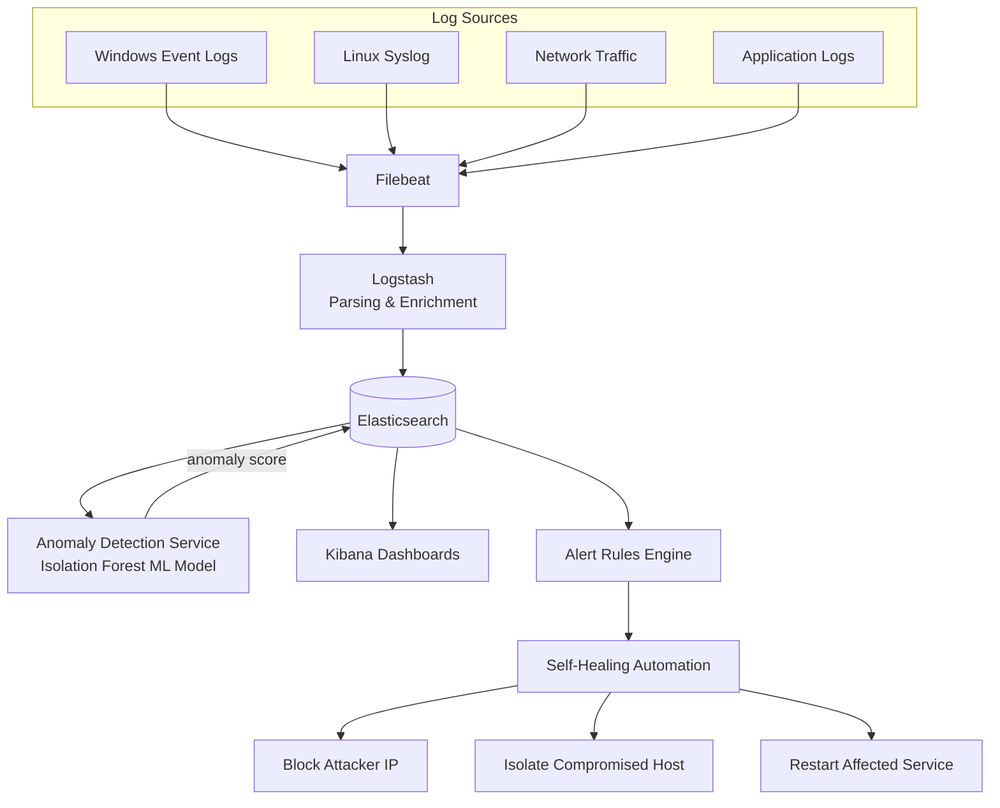

# SIEMX — AI-Driven SIEM & Automated Threat Response

A security monitoring platform that collects logs from across a network, uses machine learning to spot anomalies human analysts would miss, and automatically responds to threats — built on the ELK Stack with a custom AI detection layer and self-healing automation.


---

## Why this project

Traditional SIEM tools are great at collecting and searching logs, but they mostly rely on static rules — "alert if X happens 5 times in a minute." That catches known attack patterns but misses anything novel. SIEMX adds a machine learning layer on top of a real ELK Stack deployment: an Isolation Forest model that learns what "normal" looks like for a system and flags genuine outliers, then pairs that with automated response actions instead of just a dashboard alert.

## Architecture



## Core components

| Component | Role | Tech |
|---|---|---|
| **Log Shipping** | Collects logs from Windows, Linux, network, and app sources | Filebeat |
| **Processing Pipeline** | Parses and enriches raw logs (GROK patterns, GeoIP) | Logstash |
| **Storage & Search** | Indexes and stores all event data | Elasticsearch |
| **Anomaly Detection** | Flags outlier behavior using ML, not fixed rules | Python, scikit-learn (Isolation Forest), Flask |
| **Dashboards** | Visualizes threats, network activity, system health | Kibana |
| **Automated Response** | Reacts to confirmed threats without waiting on a human | Bash/Python automation scripts |
| **Deployment** | Repeatable, automated infrastructure setup | Docker Compose, Ansible |

## Detection rules included

- Brute-force login attempts
- Port scanning
- Unauthorized access attempts
- Data exfiltration patterns

Each is defined as a standalone rule in [`alerts/`](alerts/) and can be extended or tuned per environment.

## Automated response actions

When an alert crosses its threshold, SIEMX can automatically:
- **Block the source IP** at the firewall level
- **Isolate a compromised host** from the network
- **Restart an affected service** to recover from disruption

See [`scripts/automation/`](scripts/automation/) for the response logic.

## Quick Start

### Full deployment (Docker Compose)

```bash
git clone https://github.com/<your-username>/siemx-ai-siem.git
cd siemx-ai-siem

cp .env.example .env
# fill in your own credentials — never use the placeholder values in production

docker-compose up -d
```

Once running:
- Kibana → `http://localhost:5601`
- Elasticsearch → `http://localhost:9200`
- Anomaly Detection API → `http://localhost:5000`

### No Docker? Run the simulator instead

If you don't have Docker available, `siemx_simulator.py` runs the core detection logic standalone, without needing the full ELK stack:

```bash
pip install -r anomaly-detection/requirements.txt
python siemx_simulator.py
```

### Infrastructure-as-code deployment

```bash
cd ansible
ansible-playbook deploy-siem.yml -i inventory/hosts
```

## Testing

```bash
bash tests/integration_test.sh
python tests/test_complete_suite.py
python tests/test_performance_benchmark.py
```

## Project Structure

```
.
├── anomaly-detection/       # ML-based anomaly detection service (Flask + Isolation Forest)
├── scripts/
│   ├── automation/           # Self-healing response scripts (block IP, isolate host, restart service)
│   ├── demo/                 # Demo/walkthrough script
│   └── deployment/           # Deployment automation
├── configs/
│   ├── filebeat/              # Log shipping configuration
│   └── logstash/              # Log parsing & enrichment rules
├── ansible/                  # Infrastructure-as-code deployment
├── alerts/                   # Detection rule definitions
├── dashboards/               # Pre-built Kibana dashboards
├── tests/                    # Integration, performance, and validation tests
├── kibana_manager.py         # Kibana lifecycle management
├── siemx_simulator.py        # Run core logic without Docker/ELK
├── visualize_siemx.py        # Demo visualization script
├── docker-compose.yml
└── .env.example
```

## Tech Stack

`Elasticsearch` · `Logstash` · `Kibana` · `Filebeat` · `Python` · `scikit-learn` · `Flask` · `Docker` · `Ansible`

## License

MIT — see [LICENSE](LICENSE).
